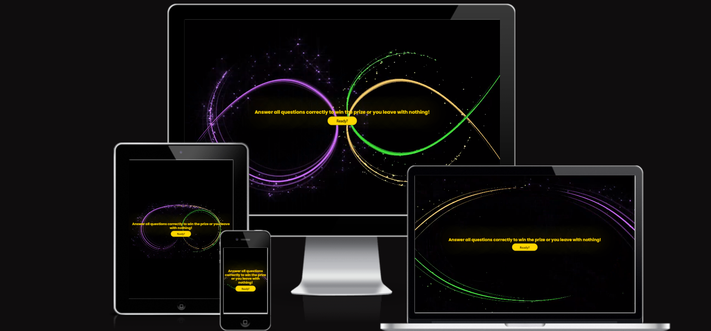
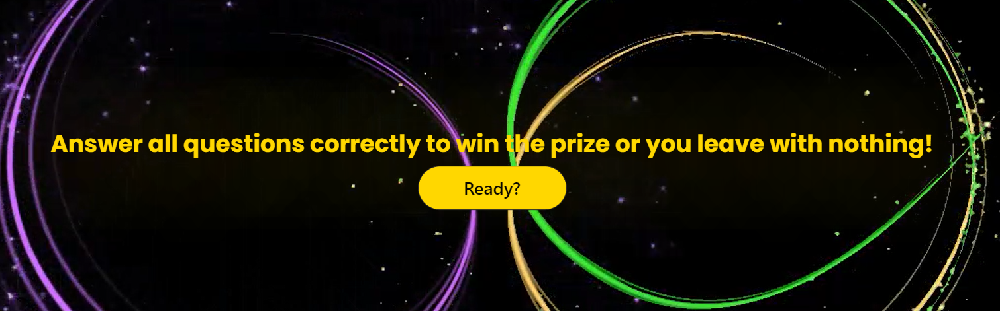
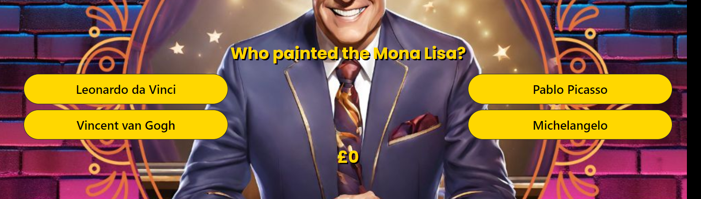
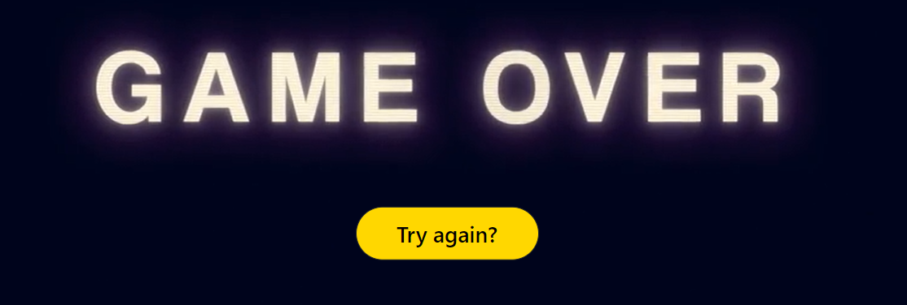

# Who wants to be a Billionaire

Who wants to be a Billionaire is an interactive quiz for children to grown ups where ten correct answers can win you a billion pounds. Its colourful, engaging structure will allow enjoyment and leave you wanting to play more.

## Developer goals

- I would like to build an engaging quiz for all ages.
- I would like users to talk about the quiz with friends/family to gain more users.
- I would like to build a colourful quiz to engage users.
- I will try to not make the questions so hard it will put people off of playing it.

## User goals

- Everyone loves a good quiz they should be able to enjoy an easy to play game.
- This quiz should be easy to navigate without being confusing.
- I would like user to find the quiz to be engaging right from the outset.
- Users should feel they want to play again and again.

### User stories

As a user of this quiz, I want:

- To be able to easily navigate through the quiz.
- To see responses to know the user has answered a question.
- To know if the user has won or lost.
- To be entertained.
- To have fun either by myself or with others. 

### Design choices

- The basic colour range for this quiz are with the following colours :-
-  `#ffd700`
-  `#ffa500`
-  `#ffffff`
-  `#000000`
-  `#008000`
-  `#ff0000`

- I chose these colours on the quiz theme.
- black as its dark in the studio.
- white, yellow and orange fall within the range for the lighting.
- green and red are universally known for correct/incorrect answers.
- I have added in graphics from video but these are similar or compliment my main theme colours.

### Wireframes

---

## Features

### Existing features

An animation once page has loaded.

Video graphics behind the start screen button.

Vibrant, uncluttered quiz layout with responsive interaction.

A game over ending animation.

A money counter for each winning question.

A winning ending animation.

---

## Technologies used

- For this website I have chosen to use HTML, CSS and JavaScript.
- I have also included Bootstrap.
- AI has been used on Canva to create the game show host and background.
- VScode was used as my IDE.
- GitHub was used to store and publish the quiz.
- Animation.css was used to create my animations.
- Pixabay for audio clips.
- Videvo for video.

---

## Testing

- [W3C CSS Validation](https://jigsaw.w3.org/css-validator/)

- [W3C Markup Validation](https://validator.w3.org/)

I have used W3C CSS and Markup Validators to check the validity of my code.

### Testing Developer Goals

1. I would like to build an engaging quiz for all ages.
- I have tested the quiz out on aselect group of people of young and old ages and they found it to be entertaining.
2. I would like users to talk about the quiz with friends/family to gain more users.
- In testing the group of people also said they would recommend to their friends.
3. I would like to build a colourful quiz to engage users.
- I feel the colours combined with the graphic animations as well as the audio builds to an engaging quiz.
4. I will try to not make the questions so hard it will put people off of playing it.
- I have adjusted some questions as the younger group found at least half quite difficult and need help.

### Testing User Stories

As a user of this quiz, I want:

1. To be able to easily navigate through the quiz.
- After the animation on page load it just takes one click to access the quiz and from there the next question/page has an automatic change on an answer click after a short time. Even the win/lose pages have an easy to see button to restart the quiz.
2. To see responses to know the user has answered a question.
- All buttons have a colour change on hover and after a click an answer is revealed right or wrong by colour and sound.
3. To know if the user has won or lost.
- After each question answer a colour indicates straight away if you are right or wrong. Right answers take you to the next question or all the way to a winner page or an incorrect will take you to the game over page.
4. To be entertained.
- Every person who tried out this quiz found it to be engaging and wanted to play again until they had won.
5. To have fun either by myself or with others.
- I feel the questions are still of a high enough quality that this could be a team quiz for all ages. 
---

## Bugs

## Deployment

This project was developed using the [VS Code IDE](https://code.visualstudio.com/), which was downloaded to my computer. Then developments and changes were commited to git and pushed to GitHub using the source control within VS Code once Node.js was downloaded and installed on my computer.

To deploy this page from its GitHub repository, the following steps were taken:

1. Log into **GitHub**.
2. From the list of repositories on the screen select **Seanl80/Who-wants-to-be-a-Billionare**.
3. From the menu items near the top of the page, select **Settings**.
4. Scroll down to **Pages** link on the left side of the screen.
5. Under **Source** click the drop down menu labelled **None** and select **Main Branch**.
6. On selecting Main Branch, click save then refresh the page and the site is now deployed.
7. Scroll back down to **GitHub Pages** section to retrieve the link to the deployed website.

### How to run this project locally

To clone this project into Gitpod you will need:

1. A GitHub account. [Create a GitHub account here](https://www.github.com).
2. Use the Chrome browser.

Then follow these steps:

1. Install the Gitpod Browser Extensons for Chrome.
2. After installation restart the browser.
3. Log into Gitpod with your Gitpod account.
4. Navigate to the Project GitHub repository.
5. Click the green "Gitpod" button in the top right of the repository.
6. This will trigger a new gitpod workspace to be created from the code in github where you can work locally.

---

## Credits

### Code

These are the sources I used for my code.

- I took inspiration from the following YouTube videos
[YouTube video from CodingHal](https://youtu.be/Vp8x8-reqZA?si=NlLqToooCAoQanbr).
[YouTube video from GreatStack](https://youtu.be/PBcqGxrr9g8?si=OCYtLCcVIRlTcusv).
- For the opening animation I used code from [Animate.CSS](https://animate.style/).

### Media

- For my images I used the AI on [Canva](https://www.canva.com/) to create them.
- For my favicon image I used [Icon Archive](https://www.iconarchive.com/show/sleek-xp-basic-icons-by-hopstarter/Money-icon.html)
- For my opening and winning video graphics I used [Videvo](https://www.videvo.net/video/abstract-streamers/4435/#rs=video-box)
- For my audio clips I used [Pixabay](https://pixabay.com/sound-effects/search/quiz%20correct%20/)
- To show my quiz on different screens I used [Am I responsive](https://ui.dev/amiresponsive/) to create them.