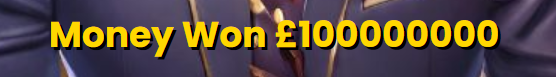

# Who wants to be a Billionaire

Who wants to be a Billionaire is an interactive quiz for children to grown ups where ten correct answers can win you a billion pounds. Its colourful, engaging structure will allow enjoyment and leave you wanting to play more.

## Developer goals

- I would like to build an engaging quiz for all ages.
- I would like users to talk about the quiz with friends/family to gain more users.
- I would like to build a colourful quiz to engage users.
- I will try to not make the questions so hard it will put people off of playing it.

## User goals

- Everyone loves a good quiz they should be able to enjoy an easy to play game.
- This quiz should be easy to navigate without being confusing.
- I would like the users to find the quiz to be engaging right from the outset.
- Users should feel they want to play again and again.

## User stories

As a user of this quiz, I want:

- To be able to easily navigate through the quiz.
- To see responses to know if I have answered a question.
- To know if I have won or lost.
- To be entertained.
- To have fun either by myself or with others. 

## Design choices

- The basic colour range for this quiz are with the following colours :-
-  `#ffd700`
-  `#ffa500`
-  `#ffffff`
-  `#000000`
-  `#008000`
-  `#ff0000`

- I chose these colours on the quiz theme.
- Black as its dark in the studio.
- White, yellow and orange fall within the range for the lighting.
- Green and red are universally known for correct/incorrect answers.
- I have added in graphics from video but these are similar or compliment my main theme colours.

## Wireframes

Here are the original wireframes:

---

## Existing features

- An animation once page has loaded.

- Video graphics behind the start screen button.

- Vibrant, uncluttered quiz layout with responsive interaction.

- A game over ending animation.

- A money counter for each winning question.

- A winning ending animation.

- Control over the sound effects.

---

## Technologies used

- For this website I have chosen to use HTML, CSS and JavaScript.
- I have also included Bootstrap.
- AI has been used on Canva to create the game show host and background.
- VScode was used as my IDE.
- GitHub was used to store and publish the quiz.
- Animation.css was used to create my animations.
- Pixabay for audio clips.
- Videvo for video.

---

## Testing

I have used these validators to check the validity of my code.

- [W3C CSS Validation](https://jigsaw.w3.org/css-validator/)

- [W3C Markup Validation](https://validator.w3.org/)
- As my animation contained the words I wanted to show, I didn't feel I needed an extra heading.

- [JShint JavaScript Validation](https://jshint.com/)
- I did have 3 unused variables as the screenshot show but these were due to being called through an onclick event in my index.html.

## Testing Developer Goals

1. I would like to build an engaging quiz for all ages.
- I have tested the quiz out on a select group of people of young and old ages and they found it to be entertaining.
2. I would like users to talk about the quiz with friends/family to gain more users.
- In testing the group of people also said they would recommend to their friends.
3. I would like to build a colourful quiz to engage users.
- I feel the colours combined with the graphic animations as well as the audio builds to an engaging quiz.
4. I will try to not make the questions so hard it will put people off of playing it.
- I have adjusted some questions as the younger group found at least half quite difficult and need help.

## Testing User Stories

As a user of this quiz, I want:

1. To be able to easily navigate through the quiz.
- After the animation on page load it just takes one click to access the quiz and from there the next question/page has an automatic change on an answer click after a short time. Even the win/lose pages have an easy to see button to restart the quiz.
-
2. To see responses to know the user has answered a question.
- All answer buttons have a colour change on hover and after a click an answer is revealed right or wrong by colour and sound.
-
3. To know if the user has won or lost.
- After each question answer a colour indicates straight away if you are right or wrong. Right answers take you to the next question or all the way to a winner page or an incorrect will take you to the game over page.

4. To be entertained.
- Every person who tried out this quiz found it to be engaging and wanted to play again until they had won.
5. To have fun either by myself or with others.
- I feel the questions are still of a high enough quality that this could be a team quiz for all ages. 
---

## Bugs

Along the quiz making journey I did encounter a few bugs which I will detail below.

- After creating my home page then adding in the animation I noticed the animation had pushed my home page below the animation. I had created the animation using a full screen viewport. This was overcome by adding a `display: none;` to my start screen home page and adding a event listener to when the animation ended.
- I added the video graphic to my start screen which went fine but on my win page when the video graphic was added it was the only thing I could see when the page loaded. I overcame this by creating seperate html pages.
- HOWEVER after I had added my sound effects to my buttons and win, lose page loads I could not control the sounds on different pages. So I had to recombine the win, lose pages with the index.html and use `display: none;` again. Then through my checkAnswer functions and loadQuestion functions I tried adding the page loads and sound effects. I found I could gain more control of them and was able to turn the sounds off or on together through one button click.
- After adding in my green/red colours to my answer buttons I felt it moved too fast as at this point I was considering adding in a sound for correct/incorrect answers, for this I added a `setTimeout(loadNextQuestion, 1000);` to my functions to decide if the answer was right or wrong.
- On my money counter it was jumping from 0, 1, 10, 20, 210, 2100 etc whereas I wanted it to increase in powers of 10. This was what I first used 
`function updateMoneyCount() {
    moneyCount++;
    if (moneyCount > 1) {
        moneyCount *= 10;
    }
    document.getElementById("money-count").textContent = "Money Won £" + moneyCount;
}`

so I updated my code to an if else which worked this is it
`function updateMoneyCount() {
  if (moneyCount === 0) {
      moneyCount = 1;
  } else {
      moneyCount *= 10;
  }
  document.getElementById("money-count").textContent = "Money Won £" + moneyCount;
}`
- After deploying the website I noticed my win page video was taking 30 seconds to load. This was different to when I was on my ide as that was an instant load. The video size was significantly larger than my other video graphics. Researching it I found the size could be a problem so I found an online compressor for free which reduced it. After checking this solved my problem.
- Once I had moved my questions into a seperate json file I found a bug. Once I had answered the first question correctly it immediately took me to the win screen at the end. To get around this I had to reorder my code as I think only the first question was loaded when the quiz had began.

## Deployment

This project was developed using the [VS Code IDE](https://code.visualstudio.com/), which was downloaded to my computer. Then developments and changes were commited to git and pushed to GitHub using the source control within VS Code once Node.js was downloaded and installed on my computer.

To deploy this page from its GitHub repository, the following steps were taken:

1. Log into **GitHub**.
2. From the list of repositories on the screen select **Seanl80/Who-wants-to-be-a-Billionare**.
3. From the menu items near the top of the page, select **Settings**.
4. Click on the **Pages** link on the left side of the screen.
5. Under **Source** click the drop down menu labelled **None** and select **Main Branch**.
6. On selecting Main Branch, click save then refresh the page and the site is now deployed.
7. Click the **Pages** section to retrieve the link to the deployed website.

### How to run this project locally

To clone this project into Gitpod you will need:

1. A GitHub account. [Create a GitHub account here](https://www.github.com).
2. Use the Chrome browser.

Then follow these steps:

1. Install the Gitpod Browser Extensons for Chrome.
2. After installation restart the browser.
3. Log into Gitpod with your Gitpod account.
4. Navigate to the Project GitHub repository.
5. Click the green "Gitpod" button in the top right of the repository.
6. This will trigger a new gitpod workspace to be created from the code in github where you can work locally.

---

## Credits

### Code

Sources used for my code.

- For the opening animation I used code from [Animate.CSS](https://animate.style/) which has been highlighted in my code.

### Media

- For my images I used the AI on [Canva](https://www.canva.com/) to create them.
- For my favicon image I used [Icon Archive](https://www.iconarchive.com/show/sleek-xp-basic-icons-by-hopstarter/Money-icon.html).
- For my opening and winning video graphics I used [Videvo](https://www.videvo.net/video/abstract-streamers/4435/#rs=video-box).
- For my audio clips I used [Pixabay](https://pixabay.com/sound-effects/search/quiz%20correct%20/).
- To show my quiz on different screens I used [Am I responsive](https://ui.dev/amiresponsive/) to create them.
- For my wirefreames I used [Balsamiq](https://balsamiq.com/).
- To compress my largest video I used [FreeCompress](https://freecompress.com/reduce-video).